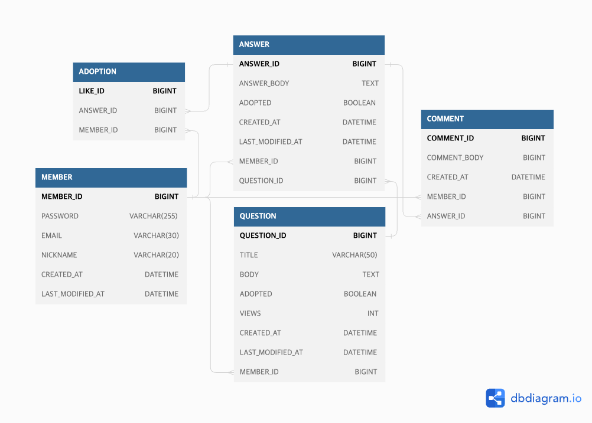

# 프로젝트 포트폴리오 목차
1. [프로젝트 개요](#-프로젝트-개요)
2. [Member](#-member)
3. [Stacks And Tools](#-stacks-and-tools)
4. [테이블 ERD](#-테이블-erd)
5. [주요 기능 요약](#-주요-기능-요약)
6. [내가 맡은 기능](#-내가-맡은-기능)
7. [문제 발생 및 해결](#-문제-발생-및-해결)

# 👨‍💻 프로젝트 개요
본격적으로 메인 프로젝트에 들어가기 이전, 개발자들의 협업방법을 체험해보기 위해 실행된 예비 프로젝트입니다. 

약 2주간 진행되었으며 유명 웹사이트(스택오버플로우)를 벤치마킹 하였습니다.

 

## 🧑🏻‍💻 Member

<table>
<tbody>
    <tr>
        <td>
            
        </td>
        <td>
            
        </td>
        <td>
            
        </td>
        <td>
            
        </td>
        <td>
            
        </td>
        <td>
            
        </td>
    </tr>
    <tr>
        <td>
주동우 [팀장/FE]
</td>
        <td>
강예현 [FE]
</td>
        <td>
안현지 [FE]
</td>
        <td>
황호준 [부팀장/BE]
</td>
        <td>
신이수 [BE]
</td>
        <td>
이태섭 [BE]
</td>
    </tr>
</tbody>
</table>

 

# 📚 STACKS AND TOOLS
### Back
- Spring Boot
- Spring Security
- Spring data JPA
- H2 DB
- Google Oauth2

### CI/CD
- AWS EC2
- AWS CodePipeline
- AWS CodeBuild
- AWS CodeDeploy
- AWS S3

### Front
- Javascript
- React
- StyledComponent

### Common
- Git
- Github
- Notion
- Discord
- Zoom

 

# 🗺️ 테이블 ERD

 

# 📌 주요 기능 요약

### 멤버십
사용자는 닉네임, 이메일, 패스워드를 입력하여 회원 가입할 수 있고, 이미 가입된 이메일은 사용할 수 없습니다. 
이메일과 패스워드를 입력하여 로그인할 수 있으며, OAuth는 구글만 가능합니다. 
회원은 닉네임과 패스워드를 변경하거나 회원 정보를 삭제할 수 있습니다. 
 
### 질문리스트
회원 여부와 상관없이 질문을 조회할 순 있지만, 게시글 작성은 회원만 가능합니다. 
게시글 작성 시 웹 에디터 라이브러리를 사용하여 다양한 서식을 적용할 수 있습니다. 
페이지네이션 기능을 통해 질문글 리스트 조회가 가능합니다. 
질문리스트에서 질문은 최신 순, 조회 순, 댓글 최신 순으로 정렬할 수 있습니다. 
 
### 댓글과 대댓글
회원만 답변 생성이 가능하며, 답변 등록 시 등록 날짜가 생성됩니다. 
답변은 사용자 정보와 함께 표시되며, 질문자는 답변 중 하나를 채택할 수 있습니다. 
답변에 대한 댓글(대댓글)이 가능합니다.
즉 3단계 depth를 가지며 질문, 답변, 댓글의 순서로 설계되었습니다.

 

# ⚙️ 내가 맡은 기능
## Stub Data Server
개발초기, 프론트엔드 팀에게 요청과 응답 템플릿을 제공하기 위해 Stub Data Server를 개설하여습니다.

Stub Data Server는 구현된 컨트롤러를 통하여 고정된 Mock Data만을 제공합니다.

개발 초기에 진행된만큼 API 주소, 응답 및 요청 데이터들의 변경이 많아 잦은 업데이트 및 배포가 실행되면서 배포 자동화의 
중요성을 깨닳고 이번 프로젝트에서 배포 자동화를 실행하게 되는 계기가 되었습니다.

- <a href="https://github.com/Mason3144/stub_data_server">[Stub Data Server 리파지토리]</a>

## 배포 자동화
AWS-EC2를 통해 배포를 마치고 AWS-Pipeline을 통해 배포 자동화를 진행했습니다.

AWS-Pipeline을 이용한 자동 배포의 흐름은 다음과 같습니다.

1. 개발자가 변경된 코드를 Github에 커밋합니다.
2. AWS-CodeBuild에서는 커밋된 코드를 감지하여 자바 파일 빌드를 수행한 뒤, EC2서버로 빌드된 파일을 전달합니다.
3. AWS-CodeDeploy에서는 작성된 쉘스크립트를 이용하여 EC2에 빌드된 파일을 실행합니다.

- <a href="https://github.com/Mason3144/seb44_pre_017/tree/main/server/scripts">[자동 배포를 위한 쉘스크립트]</a>
- <a href="https://mason-lee.tistory.com/152">[AWS 배포 자동화 블로그]</a>

[AWS-CodePipeline을 이용한 자동 배포 로그] 

## 환경변수 통합 관리
이번 프로젝트에서는 AWS-Parameter store를 이용하여 환경변수를 통합관리 하였습니다.

통합관리된 환경변수는 총 3가지로 JWT secret key, Google Oauth2 client id와 secret key입니다.

[Parameter store에 등록된 환경변수들]

개인적으로 AWS의 Parameter store보다는 Secret manager가 환경변수를 관리하기 더 편리했습니다.
이유는 다음과 같습니다.
1. Parameter store의 경우 환경변수를 하나하나 각각 등록해야했지만 Secret manager는 그룹화하여 등록할 수 있습니다.
2. Parameter store는 서버에 의존성을 추가해주고 그에 대한 설정이 필요했지만 Secret manager는 그러한 과정들이 필요가 없습니다.

## 게시글(질문) 도메인 기능 구현
질문 도메인과 관련된 컨트롤러, 비즈니스로직, 슬라이스 테스트를 구현하였습니다.

질문 도메인은 멤버, 답변, 채택 도메인과 연관관계를 갖습니다.

질문 엔티티에는 조회수와 채택에 관한 필드를 포함하고있어 게시글 목록에서 해당 정보에대한 접근이 가능합니다.

 

# 🤔 문제 발생 및 해결
### CORS 문제 발생
개발 초기 Stub Data Server를 개설하고 클라이언트와의 연결을 시도하던 중 처음 발생하였고 개발 이후 실제 서버와 연결하던 중 두번째로 발생하게 되었습니다.

Stub Data Server의 경우 **Filter** 인터페이스를 구현하여 response header에 CORS 정책을 설정해주었습니다.  
실제 서버에서는 **CorsConfiguration** 객체를 이용하여 CORS 정책을 설정하여 해결하게 되었습니다.

여담으로 Spring Security를 적용한 서버에서 **Filter** 인터페이스를 사용하여 CORS 정책을 설정해보는 실험을 하였습니다만...  
중복된 CORS 설정으로 오류를 발생하여 어플리케이션이 실행되지 않았습니다.

- <a href="https://mason-lee.tistory.com/145">[블로그 링크]</a>

### Oauth2 진행 이후 redirect 페이지에서 특정 정보에 접근하기
백엔드 서버의 배포를 완료하고 클라이언트와 연동하여 소셜로그인 기능을 진행하다 발견하게된 문제입니다.

백엔드 서버는 Oauth2 사용자 인증을 성공적으로 마치게되면 사용자에게 토큰을 발급하고 해당 토큰을 response body에 담아 보내주었지만 클라이언트에서 해당 정보를 사용할 수가 없었습니다. 
문제의 원인을 파악하여 사용자의 토큰을 쿼리 파라미터로 보내주어 문제를 해결하게 되었습니다.

- <a href="https://mason-lee.tistory.com/146">[블로그 링크]</a>

 

[[Top]](#프로젝트-포트폴리오-목차)